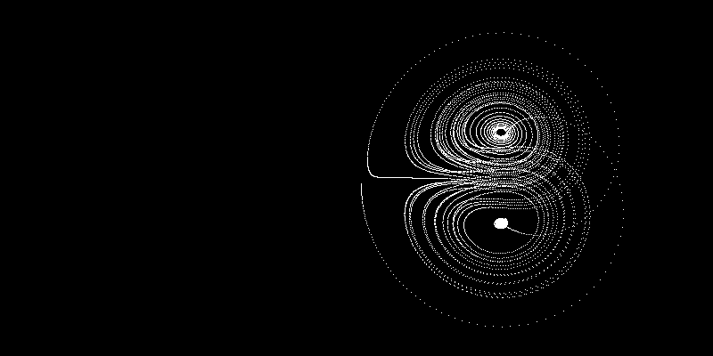
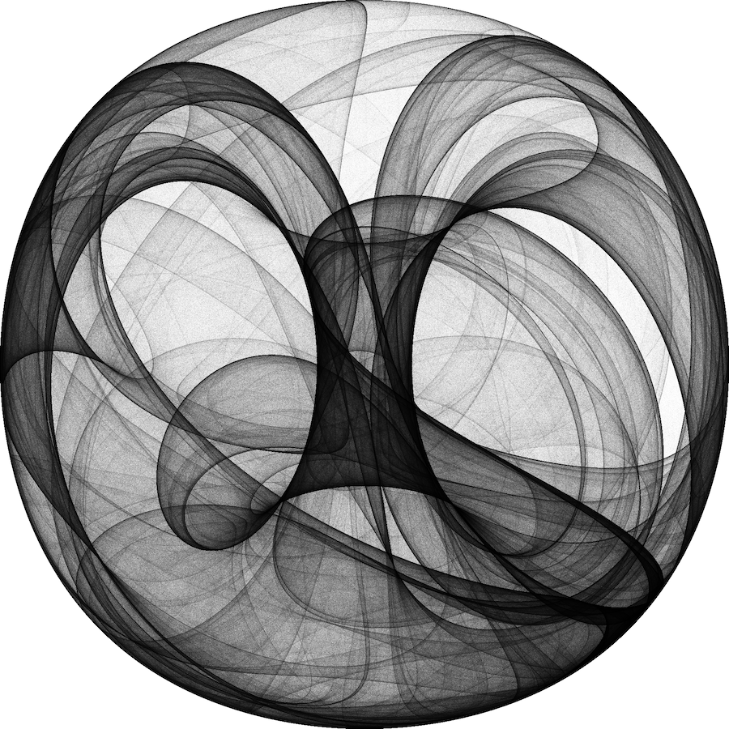
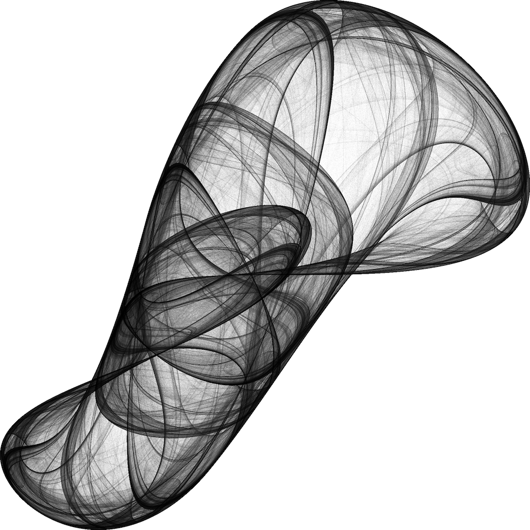
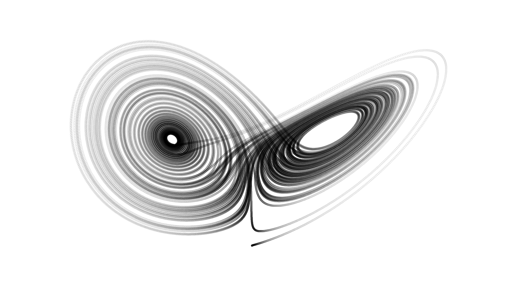

# Fractured Entropy

An interactive visualization collection exploring the mesmerizing world of [chaotic attractors](https://en.wikipedia.org/wiki/Attractor) and [strange attractors](https://en.wikipedia.org/wiki/Strange_attractor). This project renders mathematical beauty through code, creating generative visualizations that reveal the hidden patterns within chaos.

  
   
  <em>Visualization of the Lorenz Attractor, a classic example of deterministic chaos in 3D.</em>

## What Are Strange Attractors?

[Strange attractors](https://mathworld.wolfram.com/StrangeAttractor.html) are mathematical objects that emerge from deterministic chaos theory. They represent the long-term behavior of dynamic systems that are highly sensitive to initial conditions. Despite their chaotic nature, these systems create beautiful, intricate patterns that never exactly repeat but are confined to a specific region of space.

Think of them as mathematical sculptures carved by equations. Each attractor follows precise mathematical rules, yet produces organic, flowing forms that seem almost alive. They exist in the liminal space between order and chaos, creating structures that are simultaneously predictable and unpredictable.

## Visual Characteristics

Each attractor has its own distinct personality:

**[Lorenz Attractor](https://en.wikipedia.org/wiki/Lorenz_system)**: The iconic butterfly-shaped form that helped birth chaos theory. Its two wing-like lobes create graceful, swooping trajectories that never intersect themselves.

**[Rössler Attractor](https://en.wikipedia.org/wiki/R%C3%B6ssler_attractor)**: A ribbon-like structure that spirals outward before folding back on itself, creating an elegant twisted form reminiscent of a Möbius strip.

**[Chua's Circuit](https://en.wikipedia.org/wiki/Chua%27s_circuit)**: Born from electronic circuit analysis, this attractor creates complex, layered structures with multiple scroll-like regions.

**[Chen Attractor](https://en.wikipedia.org/wiki/Chen_system)**: Similar to Lorenz but with its own unique topology, creating flowing, organic shapes with subtle variations.

**Aizawa Attractor**: A more complex system producing intricate, interweaving patterns with multiple layers of detail.

And many more, each with their own mathematical DNA and visual signature.

## The Mathematics Behind the Beauty

These attractors emerge from systems of differential equations, where the rate of change of each variable depends on the current state of the system. The beauty lies in how simple mathematical rules can generate such complex, beautiful forms.

The equations are integrated over time using numerical methods like Runge-Kutta, allowing us to trace the path of a point as it evolves through the system's phase space. Each point's trajectory is influenced by the system's parameters, creating the characteristic shapes we observe.

What makes these systems "strange" is their sensitive dependence on initial conditions. Two points starting infinitesimally close together will eventually diverge exponentially, yet both remain bounded within the attractor's structure. This creates the fractal-like detail that makes each attractor visually compelling at multiple scales.

<table>
  <tr>
    <td align="center">
       
      <em>Clifford Attractor</em>
    </td>
    <td align="center">
       
      <em>De Jong Attractor</em>
    </td>
    <td align="center">
       
      <em>Lorenz Attractor</em>
    </td>
  </tr>
</table>

## Technical Implementation

The project uses [p5.js](https://p5js.org/) for rendering and mathematical computation. Each attractor is implemented as a separate module with its own differential equations and visualization parameters. The system dynamically loads and switches between different attractors, providing smooth transitions and proper cleanup of WebGL contexts.

### Key Features

- Real-time 3D rendering with WebGL acceleration
- Interactive camera controls for exploring attractor geometry
- Optimized particle systems for fluid animation
- Dynamic color palettes that respond to mathematical properties
- Responsive design that adapts to different screen sizes

## For Creative Technologists

This project sits at the intersection of mathematics, physics, and visual design. Strange attractors offer a rich source of inspiration for:

- Generative art and algorithmic design
- Interactive installations and digital sculptures
- Data visualization techniques
- Understanding complex systems and emergent behavior
- Exploring the relationship between mathematical beauty and visual aesthetics

The code is structured to be easily extensible. Each attractor is self-contained, making it simple to add new systems or modify existing parameters to explore different visual possibilities.

## Running the Project

1. Clone the repository
2. Serve the files using a local web server (due to CORS restrictions with loading modules)
3. Open `index.html` in your browser
4. Click "Next Attractor" to cycle through different mathematical worlds

The visualization will automatically start with the first attractor. Each system runs in real-time, showing the continuous evolution of the mathematical system.

## The Aesthetic of Chaos

What makes strange attractors particularly compelling for designers is how they bridge the gap between mathematical precision and organic beauty. They demonstrate that complexity and beauty can emerge from simple rules, offering lessons for generative design and algorithmic creativity.

These systems remind us that some of the most beautiful patterns in nature and mathematics arise not from careful planning, but from the interplay of simple forces following consistent rules over time. They represent a kind of controlled chaos, where randomness and determinism dance together to create something neither could achieve alone.

## Exploration and Experimentation

The project encourages exploration. Each attractor responds to parameter changes, initial conditions, and integration methods in unique ways. Small modifications can lead to dramatically different visual outcomes, making this a rich playground for experimentation.

Consider this not just as a visualization tool, but as a window into the mathematical structures that underlie complex systems throughout nature and art. The patterns you see here echo in everything from weather systems to neural networks, from population dynamics to financial markets.

## Contributing

The modular structure makes it easy to add new attractors or modify existing ones. Each attractor file is self-contained, requiring only the implementation of the differential equation and initial conditions. This makes the project accessible to both mathematicians wanting to visualize their systems and artists wanting to explore new forms of mathematical beauty.

## Further Reading

- [Chaos Theory](https://en.wikipedia.org/wiki/Chaos_theory) - The mathematical framework underlying these visualizations
- [Dynamical Systems](https://en.wikipedia.org/wiki/Dynamical_system) - The broader mathematical context
- [Fractal Geometry](https://en.wikipedia.org/wiki/Fractal) - The geometric structures that emerge from chaotic systems
- [Nonlinear Dynamics](https://scholarpedia.org/article/Nonlinear_dynamics) - Advanced mathematical concepts

## License

This project is open source and available under the MIT License.
